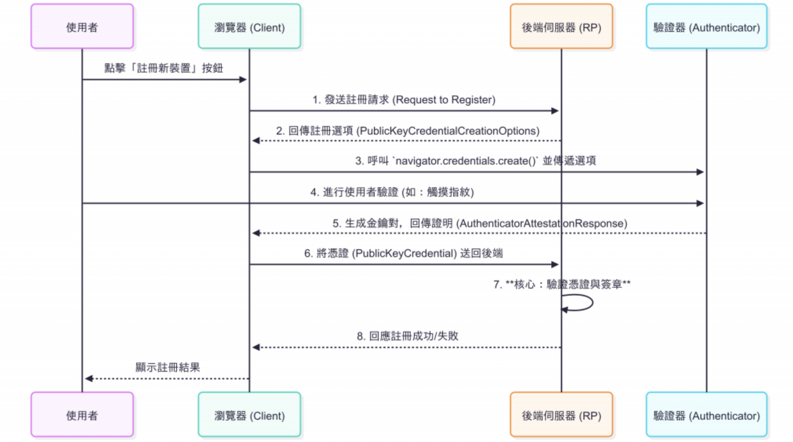

# FIDO2 / WebAuthn 說明

## 角色說明

### 1️⃣ RP（Relying Party）

- RP = 你寫的後端伺服器（Spring Boot + Yubico lib）
- 它是「信任方」：
  - 負責生成 challenge
  - 定義支援的演算法
  - 驗證簽章
  - 存公鑰

### 2️⃣ 瀏覽器

- 瀏覽器是 RP 的代理/中介
- 任務：
  - 接收 RP 後端傳來的 `PublicKeyCredentialCreationOptions`（含 challenge、excludeCredentials 等）
  - 呼叫本機 Authenticator（手機/硬體金鑰）
  - 回傳 `PublicKeyCredential` 給 RP
- 例如:瀏覽器只是執行 RP 的指令，所以當 RP 提供 `excludeCredentials`，瀏覽器就會知道哪些 credential 不能再被註冊

### 3️⃣ Authenticator

- 真正生成金鑰對、簽署 challenge 的黑盒
- 瀏覽器把 RP 的規則傳給它，讓它遵守
- 例如:手機的Authenticator

### 🔹 角色之間的流程圖

```text
User                 RP（網站/服務）                Authenticator
 |                        |                              |
 |---- 開始註冊/登入 --->  |                              |
 |                        |---- 產生 challenge --------> |
 |                        |<--- 簽署/回傳 publicKey ----  |
 |<--- 註冊成功/登入 OK -- |                              |
```

---

## 註冊流程

### 註冊流程序列圖 (Sequence Diagram)

(來源 https://ithelp.ithome.com.tw/articles/10374845)



---

## Yubico lib 及 WebAuthn 標準說明

以下內容整理自 Yubico lib 及 WebAuthn 標準。

### PublicKey

#### 用來描述一次 FIDO2/WebAuthn 註冊請求的完整資訊，包括 RP、使用者、挑戰、支援的公鑰演算法、Authenticator 選擇、attestation 與擴充功能，前端據此生成憑證。

- **rp**: Relying Party，應用程式後端伺服器。RP 的角色是「服務端，你信任它來驗證使用者身份」，它提供 challenge，接收 Authenticator 簽署的結果，決定登入或註冊是否成功。

- **user**: 使用者資訊。

- **challenge**: 本質上是一個一次性隨機數（nonce）。瀏覽器的 WebAuthn API 要求 challenge 是 ArrayBuffer/Uint8Array，方便做加密簽章；後端通常用字串傳輸（JSON），所以需要把 ByteArray 轉成 Base64URL，以便 JSON / HTTP 傳輸，瀏覽器收到再轉回 ByteArray 用於加密簽章。

- **pubKeyCredParams**: 告訴瀏覽器／Authenticator 你想支援哪些公鑰類型和演算法。瀏覽器會選擇其中一種支援的演算法生成金鑰對，回傳給 RP。

- **timeout**: 限制挑戰有效時間，防止舊 challenge 被重用。

- **excludeCredentials**: 讓 RP 可以避免重複註冊或辨識使用者現有裝置。告訴瀏覽器「這些 credential 已存在，請不要再用它們註冊」，類似 blacklist。

- **authenticatorSelection**: 指定如何選擇 Authenticator（平台 / 跨平台、user verification）。後端若未設定默認是 PLATFORM → 只用瀏覽器內建 Authenticator；加了才能使用手機掃 QR code 登入。

- **attestation**: 告訴 RP 後端希望 Authenticator 回傳哪種 attestation，也就是如何證明這把金鑰是合法、受信任的裝置產生的。
  - NONE: 不需要 attestation，RP 不關心金鑰來源（練習 / demo 常用）
  - INDIRECT: 需要 attestation，但不要求特定 CA 簽章
  - DIRECT: 需要 attestation，並要求特定 CA 簽章
  - ENTERPRISE: 企業內部使用的 attestation
- **extensions**: 註冊擴充功能。
  - **appidExclude**: 用途：主要用在舊版 U2F 向下相容。當你還想支援 U2F 裝置（舊硬體金鑰）時，可以指定一個 AppID 排除清單。現代 WebAuthn 練習 / YubiKey 不必使用。
  - **credProps**: 用途：詢問 Authenticator 是否支援一些 credential 屬性，例如是否支援「resident key」（可存放在硬體裡的使用者金鑰）。若 true → Authenticator 回傳 credProps 結果，RP 可決定是否接受。
  - **uvm**: 是否要求回傳使用者驗證方式（User Verification Methods）。
  - **largeBlob**: 內部型別，後端用，前端不用定義或可留空。
